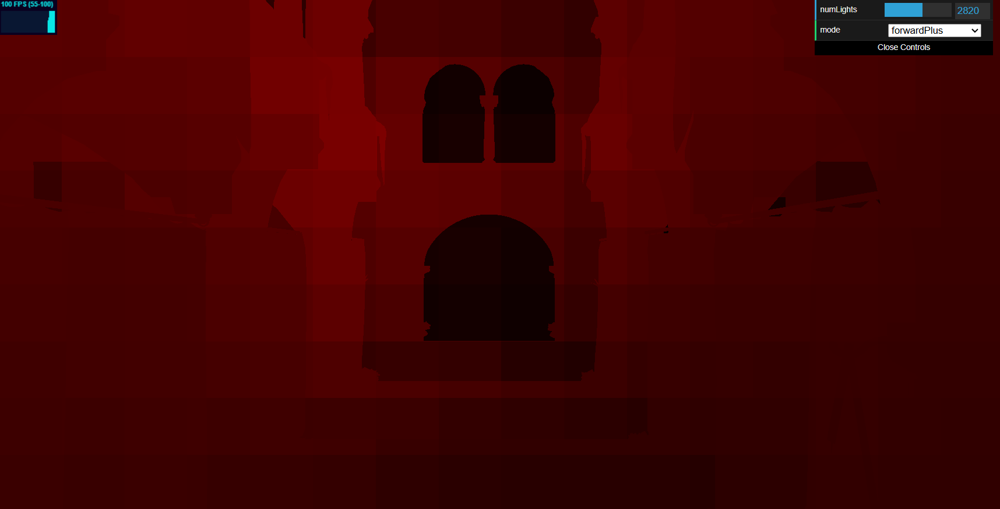
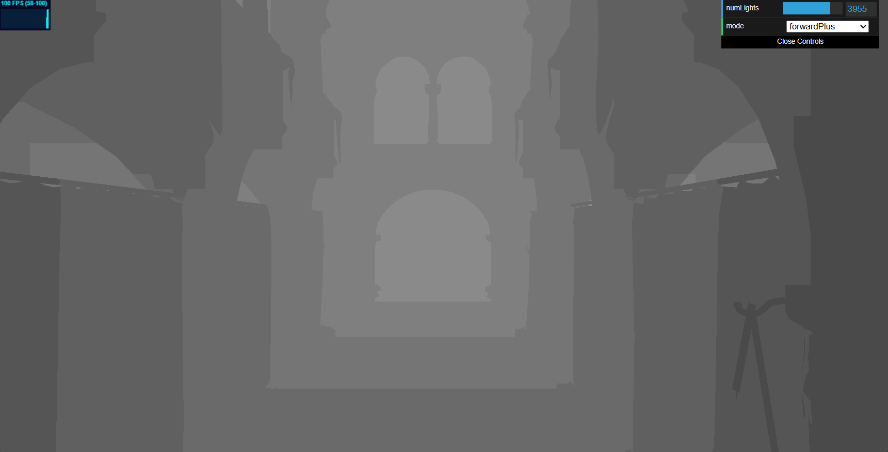
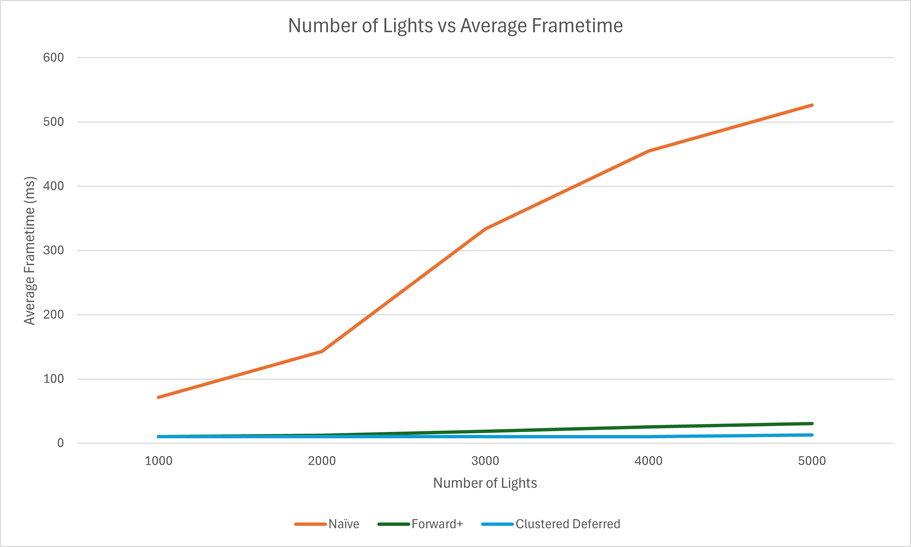
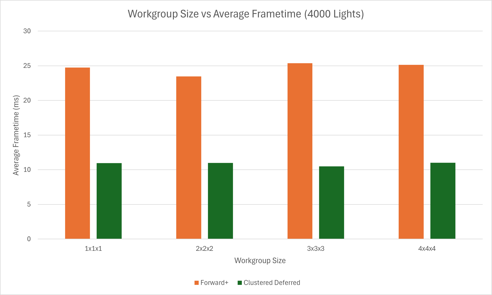
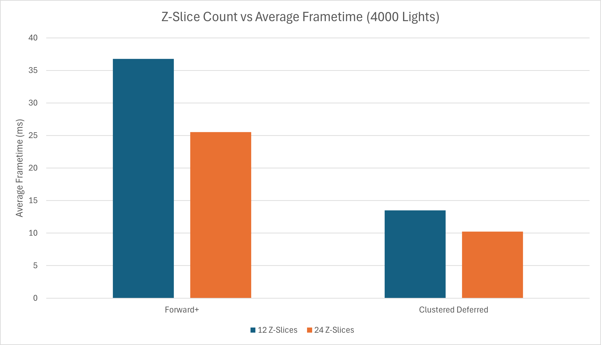
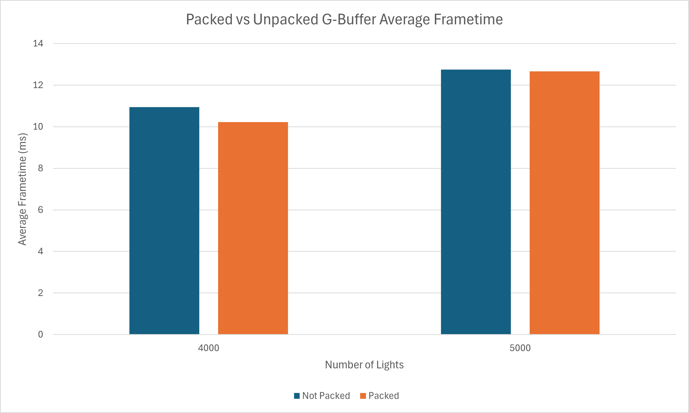

WebGPU Forward+ and Clustered Deferred Shading
======================

**University of Pennsylvania, CIS 565: GPU Programming and Architecture, Project 4**

* Aaron Tian
  * [LinkedIn](https://www.linkedin.com/in/aaron-c-tian/), [personal website](https://aarontian-stack.github.io/)
* Tested on: Windows 22H2 (26100.6584), Intel Core Ultra 7 265k @ 3.90GHz, 32GB RAM, RTX 5070 12GB (release driver 581.15)

## Live Demo

[Link](https://aarontian-stack.github.io/Project4-WebGPU-Forward-Plus-and-Clustered-Deferred/)

## Summary

A WebGPU implementation of the Forward+ Clustered and Clustered Deferred shading algorithms as described in the paper ["Clustered Deferred and Forward Shading" by Ola Olsson, Markus Billeter, and Ulf Assarsson](https://www.cse.chalmers.se/~uffe/clustered_shading_preprint.pdf). These algorithms allow for the shading of scenes with a large number of dynamic lights by culling the lights needed to shade a given pixel by bucketing the lights into 3D "clusters" that make up the view frustum. 

## Implementation

### Naive (Forward Rendering)

In a simple naive shading implementation, for each fragment created by each draw call we loop through all lights in the scene and sum the lighting contribution to get the final color output. This becomes very expensive as the number of lights increases. It is made worse by the fact that the forward rendering causes overdraw, where we spend lots of compute time shading pixels that are later overwritten by other pixels with a lower depth value.

### Forward+ Clustered Shading

An observation we can make is that for any given pixel, not all the lights in the scene will contribute to its final color. Assuming point lights only, we can establish a maximum radius distance for each light beyond which the light does not contribute to the pixel's color. If we can determine which lights influence which pixels, we can reduce the number of lights needed to iterate over for each pixel.

This is accomplished by dividing the view frustum into a 3D grid of "clusters". Each cluster is essentially a bucket that contains a array of indices of lights that influence any pixels within that cluster. We iterate through all lights in the scene and determine which clusters they intersect with, adding their indices to those clusters' array of lights. Then during the rendering pass, for each fragment we determine which cluster it belongs to and only iterate over the lights in that cluster's light array to compute the final color.

  
   
  
Visualization of Z-slices of clusters (<a href="https://www.aortiz.me/2018/12/21/CG.html">image source</a>)

Clusters are created by dividing the screen into a grid of tiles, then slicing the view frustum along the depth axis on a logarithmic scale to account for non-linearity of depth. Each cluster is thus a sub-frustum defined by its screen-space bounds and near/far depth values.

In practice, a compute shader is used to build these clusters based on the camera's view frustum, and each cluster determines what lights should be assigned to them based on whether the light's bounding sphere intersects with the cluster's AABB (created from the four points of the cluster's bounds) in view space. During the shading, we compute the 1D cluster index from the pixel's screen coordinates and depth, which is used to look up the array of lights for that cluster. Shading then proceeds as normal but now with a reduced number of lights to iterate over. The light radius ensures that the visual result remains correct.

  
   
  
Visualization of the number of lights in each cluster. Brighter clusters have more lights.

  
   
  
Visualization of cluster slice indices. Each slice corresponds to a different depth range.

### Clustered Deferred Shading

This culling strategy can easily be adapted to deferred rendering as well. We first render the scene's geometry into a G-buffer containing the per-pixel attributes we want. Then during the deferred shading pass, we can compute the cluster index of the pixel using its screen coordinates and depth from the depth buffer and look up the lights for that cluster to shade the pixel.

In my implementation, I use a single color attachment for the G-buffer that contains the albedo/diffuse color of the texture (RGBA8) and the three normal components (RGB32). This is 4+12 = 16 bytes per pixel, which fits within a single RGBA32uint texture. The albedo is stored in the first four bytes of the pixel, and the normal is stored in the next 12 bytes during the G-buffer pass. This value is unpacked in the shading pass to compute the final color. The position needed to shade the pixel is reconstructed from the depth buffer and screen coordinates using the inverse projection matrix of the camera, which removes the need to store a costly high-precision position buffer in the G-buffer.

  
   
  
Final rendered output using clustered deferred shading with 5000 dynamic point lights.

## Performance Analysis

Timings are taken on a 3440x1440p 100 Hz monitor, which causes the frame time to cap at a minimum of 10 ms. **Cluster dimensions are 16x9x24, the workgroup size is 32, and each cluster can store 1024 light indices unless otherwise specified.** Lower frametime is better.

For the workgroup size and cluster dimension tests, I use 4000 lights, the reasoning being that this was the light count that started to cause the clustered deferred implementation to drop below 10 ms. Thus we can see performance differences while not being too compute bottlenecked.

### Number of Lights

Increasing the number of lights roughly causes a linear increase in frametime for the naive forward rendering approach, which is expected. The application becomes unusable after only 1000 lights. Forward+ and Clustered Deferred both provide significant improvements, with Clustered Deferred being the overall better option in this Sponza scene. Both benefit from the same light culling strategy, but Clustered Deferred also has no overdraw due to the deferred rendering approach. This is especially relevant given the high resolution I am rendering at (more pixels means more overdraw).

Depending on the kind of rendering you want to do, a forward rendering approach may still be preferable due to its ability to handle transparent objects, MSAA, and ease of implementing rendering techniques such as decals.

### Workgroup Size

Changing the workgroup size used in the clustering compute shader does not really have a significant impact on overall performance. I suspect that the frametime is primarily bound by the pixel shading, which causes any difference in the clustering compute shader to not be very noticeable. Intuitively, clusters that are close to each other should have similar lights assigned to them due to 3D spatial locality, so it should be relatively coherent, and a larger workgroup size may take advantage of that, but we don't really see that across the board here.

### Cluster Dimensions

Adjusting the number of Z-slices should logically change the number of lights per cluster. Fewer slices mean more lights per cluster, which intuitively should translate to worse performance due to increased shading pressure. In the below graph, I only test with 12 and 24 slices as smaller numbers cause incorrect images due to the clusters not being able to store all the lights.

We see that this is indeed true, with 24 slices performing better than 12 slices.

In general you probably want to choose X and Y cluster dimensions that match your display aspect ratio, as this will ensure there is an even number of pixels per cluster in screen space.

### G-Buffer Packing

By packing the albedo and normal into a single G-buffer texture, we improve memory coherence (albedo and normal are coherent and read together per pixel in the shading pass) and save memory (no longer need to store a useless fourth channel for the previous separate normal buffer, which is another 4 bytes per pixel). 

We see a slight improvement in overall frametime, which is made more apparent at lower light counts when there is less compute pressure from shading.

## Credits

- [Vite](https://vitejs.dev/)
- [loaders.gl](https://loaders.gl/)
- [dat.GUI](https://github.com/dataarts/dat.gui)
- [stats.js](https://github.com/mrdoob/stats.js)
- [wgpu-matrix](https://github.com/greggman/wgpu-matrix)
